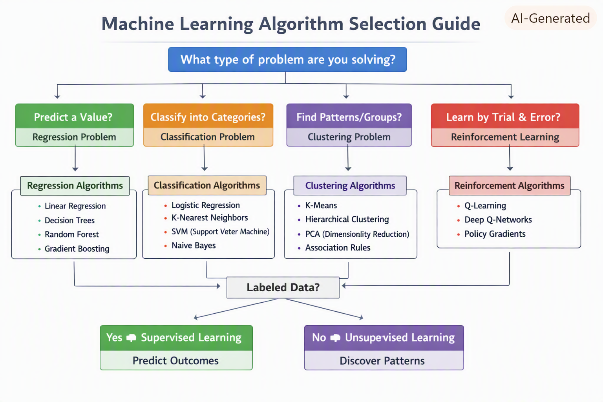
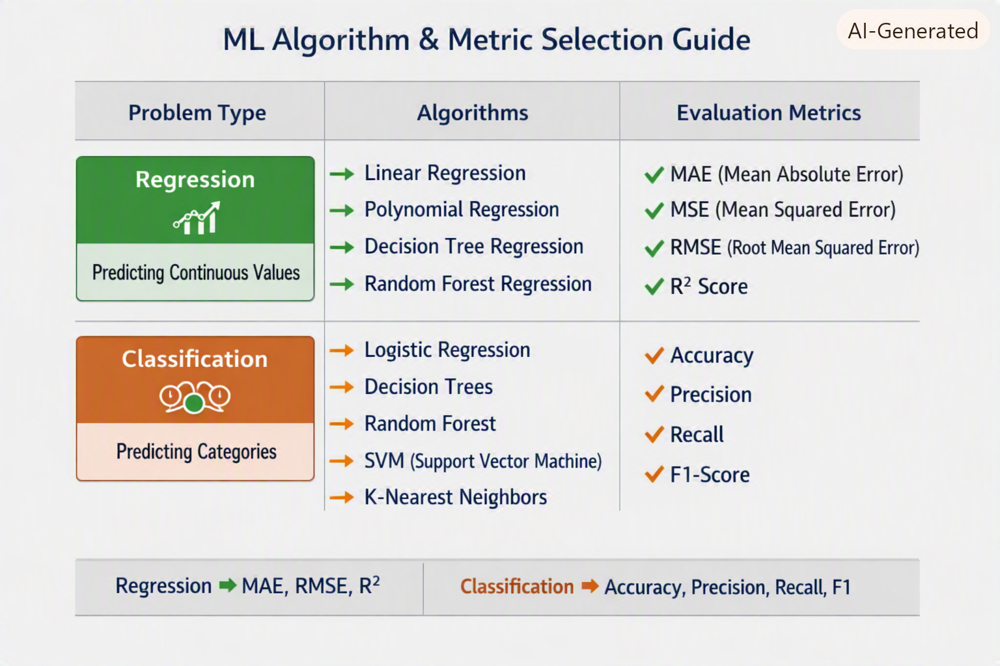
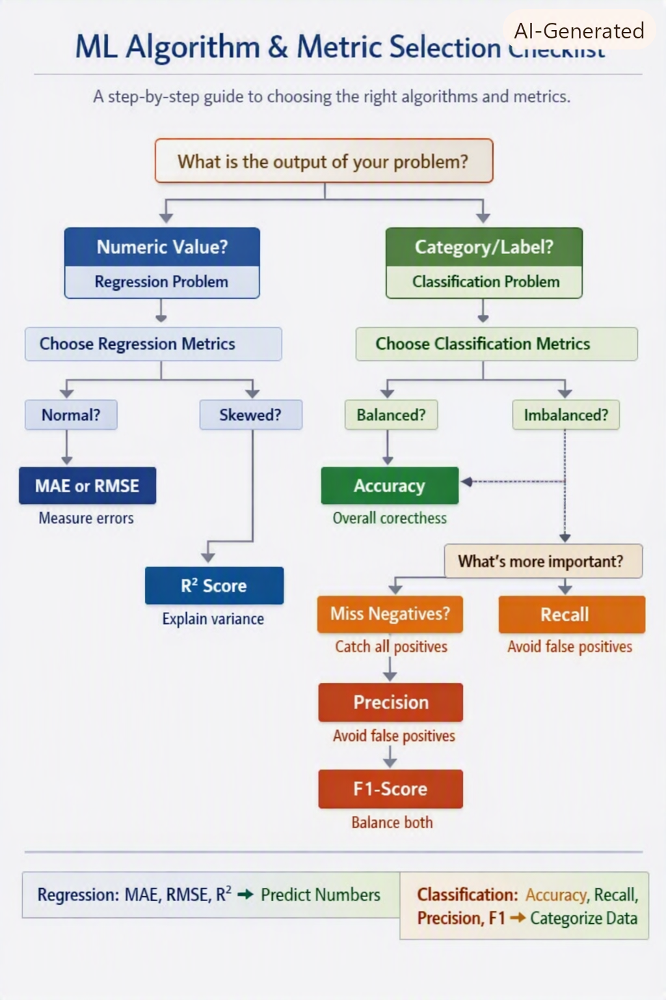

### Supervised Learning Algorithms (use labeled data)

Linear Regression → Predict continuous values (e.g., house prices).

Logistic Regression → Binary/multi-class classification (e.g., spam detection).

Decision Trees → Rule-based splits for classification/regression.

Random Forest → Ensemble of decision trees for higher accuracy.

Support Vector Machines (SVM) → Finds hyperplanes to separate classes.

K-Nearest Neighbors (KNN) → Classifies based on closest neighbors.

Naive Bayes → Probabilistic classifier, often used in text/spam filtering.

Gradient Boosting / XGBoost / LightGBM → Powerful ensemble methods for tabular data.

----------------------------------------------------------------------------------------------

### Unsupervised Learning Algorithms (use unlabeled data)

K-Means Clustering → Groups data into clusters.

Hierarchical Clustering → Builds nested clusters.

Principal Component Analysis (PCA) → Dimensionality reduction, visualization.

Autoencoders → Neural networks for feature learning and anomaly detection.

Association Rule Learning → Market basket analysis (e.g., “people who buy bread also buy butter”).

---------------------------------------------------------------------------------------------------

### Reinforcement Learning Algorithms (trial & error with rewards)

Q-Learning → Learns optimal actions via reward feedback.

SARSA → Similar to Q-learning but updates based on actual actions taken.

Deep Q-Networks (DQN) → Combines Q-learning with deep neural networks.

Policy Gradient Methods → Directly optimize decision policies.

------------------------------------------------------------------------------------------------

| Category            | Algorithms                                                                                   | Example Use Case                            |
|---------------------|----------------------------------------------------------------------------------------------|---------------------------------------------|
| **Supervised**      | Linear Regression, Logistic Regression, Decision Trees, Random Forest, SVM, KNN, Naive Bayes | Predicting house prices, spam detection     |
| **Unsupervised**    | K-Means, Hierarchical Clustering, PCA, Autoencoders, Association Rules                       | Customer segmentation, anomaly detection    |
| **Reinforcement**   | Q-Learning, SARSA, DQN, Policy Gradient                                                      | Self-driving cars, game AI                  |
| **Semi-Supervised** | Self-training, Semi-supervised SVMs, Graph-based                                             | Medical diagnosis with limited labeled data |

    Supervised → labeled data, prediction/classification.
    
    Unsupervised → unlabeled data, clustering/patterns.
    
    Reinforcement → trial & error with rewards.
    
    Semi-supervised → mix of labeled + unlabeled.

--------------------------------------------------------------------------------------------
🧭 Step 1: Identify the Type of Problem

--------------------------------
👉 In short:
--------------------------------
>   Predicting values → Regression.

>   Predicting categories → Classification.

>   Finding groups → Clustering.

>   Learning by trial & reward → Reinforcement.

------------------------------------------------------------------------------------------------
Regression → Predicting a continuous number.

Classification → Predicting categories/labels.

Clustering → Grouping unlabeled data.

Reinforcement → Learning by trial & reward.

------------------------------------------------------------------------------------------------

### 📘 Supervised Learning Examples

| Problem Statement                       | Algorithm             | Why                                              |
|-----------------------------------------|-----------------------|--------------------------------------------------|
| **Predict house prices**                | [Linear Regression]   | Output is continuous (price).                    |
| **Predict if a customer will churn**    | [Logistic Regression] | Binary classification (churn / not churn).       |
| **Loan approval decision**              | [Decision Tree]       | Rule-based, interpretable decisions.             |
| **Fraud detection in transactions**     | [Random Forest]       | Complex classification, robust against noise.    |
| **Handwriting recognition**             | [KNN]                 | Classifies based on similarity to known samples. |
| **Text spam filtering**                 | [Naive Bayes]         | Works well with word probabilities in text.      |
| **Image classification (cats vs dogs)** | [SVM]                 | Finds optimal boundary between classes.          |

------------------------------------------------------------------------------------------------------

### 📗 Unsupervised Learning Examples

| Problem Statement                                  | Algorithm           | Why                                  |
|----------------------------------------------------|---------------------|--------------------------------------|
| **Group customers by buying behavior**             | [K-Means]           | Clusters unlabeled data.             |
| **Reduce dataset dimensions for visualization**    | [PCA]               | Projects data into fewer dimensions. |
| **Market basket analysis (items bought together)** | [Association Rules] | Finds item co-occurrence patterns.   |

----------------------------------------------------------------------------------------------------------------------------------

###     📙 Reinforcement Learning Examples

| Problem Statement               | Algorithm         | Why                                   |
|---------------------------------|-------------------|---------------------------------------|
| **Self-driving car navigation** | [Q-Learning]      | Learns by trial & reward.             |
| **Game AI (chess, Go)**         | [Policy Gradient] | Optimizes strategies through rewards. |

---------------------------------------------------------------------------------------------------------------------------------------

### 🚀 Practical Rule of Thumb

Ask: What is the output?

-   Number → Regression.

-   Category → Classification.

-   Groups/patterns → Clustering.

-   Actions with feedback → Reinforcement.

Ask: Do I need interpretability or accuracy?
-   Interpretability → Decision Tree, Logistic Regression.
-   Accuracy/robustness → Random Forest, Gradient Boosting.

Ask: Is the dataset labeled?

-   Labeled → Supervised.
-   Unlabeled → Unsupervised.

--------------------------------
👉 In short:
--------------------------------
>   Predicting values → Regression.

>   Predicting categories → Classification.

>   Finding groups → Clustering.

>   Learning by trial & reward → Reinforcement.

    Numbers → Regression

    Categories → Classification

    Groups → Clustering

    Trial & reward → Reinforcement
------------------------------------------------------------------------------------------------------------------------

---------------------------------------------------------------------------------------------------------------

| Problem Type       | Example Problem               | Recommended Algorithms                              | Most Important Metric | Why It Matters                                            |
|--------------------|-------------------------------|-----------------------------------------------------|-----------------------|-----------------------------------------------------------|
| **Regression**     | Predicting house prices       | [Linear Regression], [Random Forest Regression]     | [RMSE]                | Measures average prediction error in same units as price. |
| **Regression**     | Forecasting sales or demand   | [Decision Tree Regression], [XGBoost]               | [MAE]                 | Easier to interpret for business forecasting.             |
| **Regression**     | Predicting energy consumption | [Polynomial Regression], [Random Forest Regression] | [R² Score]            | Shows how well model explains variance.                   |
| **Classification** | Employee attrition prediction | [Logistic Regression], [Random Forest]              | [F1-Score]            | Balances precision and recall for imbalanced data.        |
| **Classification** | Fraud detection               | [Random Forest], [SVM]                              | [Recall]              | Missing a fraud case is costly — recall is critical.      |
| **Classification** | Spam email filtering          | [Naive Bayes], [SVM]                                | [Precision]           | Avoids false positives (legit emails marked as spam).     |
| **Classification** | Medical diagnosis             | [Logistic Regression], [Decision Tree]              | [Recall]              | Missing a positive case (disease) is dangerous.           |
| **Classification** | Sentiment analysis            | [Naive Bayes], [Random Forest]                      | [Accuracy]            | Balanced classes — overall correctness matters.           |

Quick Summary
-------------------------------------------------------------------------

Regression → Numeric output → MAE, RMSE, R².

Classification → Categorical output → Accuracy, Precision, Recall, F1.

Choose metric based on business impact:

Cost of missing positives → Recall.

Cost of false alarms → Precision.

Need balance → F1.

Continuous prediction → RMSE or MAE.

----------------------------------------------------------------------

| Problem                           | Problem Type     | Candidate Algorithms                                | Best Metric | Why                                                    |
|-----------------------------------|------------------|-----------------------------------------------------|-------------|--------------------------------------------------------|
| **House Price Prediction**        | [Regression]     | [Linear Regression], [Random Forest Regression]     | [RMSE]      | Shows average prediction error in same units as price. |
| **Sales Forecasting**             | [Regression]     | [Decision Tree Regression], [XGBoost]               | [MAE]       | Easy to interpret for business forecasting.            |
| **Energy Consumption Prediction** | [Regression]     | [Polynomial Regression], [Random Forest Regression] | [R² Score]  | Explains how much variance is captured.                |
| **Employee Attrition**            | [Classification] | [Logistic Regression], [Random Forest]              | [F1-Score]  | Balances precision & recall for imbalanced data.       |
| **Fraud Detection**               | [Classification] | [Random Forest], [SVM]                              | [Recall]    | Missing fraud cases is costly.                         |
| **Spam Filtering**                | [Classification] | [Naive Bayes], [SVM]                                | [Precision] | Avoids false positives (legit emails marked spam).     |
| **Medical Diagnosis**             | [Classification] | [Logistic Regression], [Decision Tree]              | [Recall]    | Missing a positive case (disease) is dangerous.        |
| **Sentiment Analysis**            | [Classification] | [Naive Bayes], [Random Forest]                      | [Accuracy]  | Balanced classes → overall correctness matters.        |

Quick Rules
---------------------------

Regression → Numeric output → MAE, RMSE, R².

Classification → Categorical output → Accuracy, Precision, Recall, F1.

Pick metric based on business impact:

Cost of missing positives → Recall.

Cost of false alarms → Precision.

Need balance → F1.

Continuous prediction → RMSE or MAE.

================================================================================

How to Apply This Checklist
Start with the output type

Numeric → Regression.

Category → Classification.

For Regression

If data is normally distributed → use MAE or RMSE.

If data is skewed or has outliers → use R² Score to explain variance.

For Classification

If classes are balanced → use Accuracy.

If classes are imbalanced →

Missing positives is costly → use Recall.

False alarms are costly → use Precision.

Need balance → use F1-Score.

=========================================================================

Quick Summary
Regression → MAE, RMSE, R² depending on distribution and business need.

Classification → Accuracy, Precision, Recall, F1 depending on class balance and cost of errors.